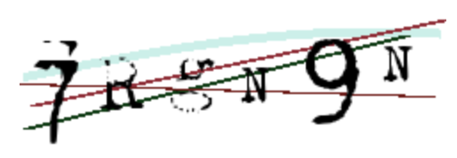

# What is Zeekaptcha

Zeekaptcha is the world’s first Web3 captcha.
Unlike Web2 captchas, the verification is done in a smart contract enabling on-chain reputation,
bot-resistant smart contract applications, and more.

Zeekaptcha is one of the few production-grade zk applications accessible to all
as an open-source public good.

# How does it work?
Take the example of a text-based captcha challenge. This is a simple test that requires the user to transcribe
letters and numbers that are shown in an image. If they transcribe the text correctly, the captcha is said to be
solved successfully.



Let's fix Alice, the challenge solver, and Bob, the captcha creator. We will later introduce Mallory, a malicious actor
that will attempt to thawrt our construction.

For Bob to generate a valid zeekaptcha challenge, he will generate 3 things, the `solution_text`, the `image`,
and the `hash` of the solution_text. In our above example,
- `solution_text` == `'7RgN9N'`.
- `image` is the base64 encoding of the png.
- `hash` == `keccak256('7RgN9N)`.

Bob sends only the `image` and `hash` to Alice. With this information, Alice has no ability to reconstruct
the correct answer without transcribing the image herself. In other words, the preimage to the hash is "encoded" into
the image.

Now how do we verify her solution on-chain? Let's work on this constructively, starting with the trivial solution,
seeing where it fails, and building up to where zeekaptcha is today.

In all of these instances, we will have some way of solving these challenges off-chain, with the captcha
verification existing in an on-chain smart-contract.

### Trivial Approach: On-Chain Lookup
Bob can set a mapping in the contract with all valid captcha solutions as the keys with a boolean flag indicating
that the specific key is valid.

Once Alice finds the `solution_text`, she can send it as data in a transaction to the verification smart contract.
If a match is found against this mapping, it implies that Alice solved a captcha correctly that was created by Bob.
That key will then be marked as invalid in the mapping once it has been used.

There are some serious problems with this approach:
1. **Replay Attacks**: Once Alice submits her solution as transaction calldata, it now becomes public to the mempool.
The malicious actor, Mallory, can listen to the mempool, pick up Alice's solution, and forward it himself with
higher gas to frontrun Alice.

1. **Public Solutions**: Since the mapping is in the smart contract, it can therefore be publicly read.
A malicious attacker need not even solve the challenge, but simply read which keys have not be already used,
and send this to the contract.

This ruins our construction as an effective anti-botting strategy. It becomes obvious that we need a way for Alice to show that she solved the captcha challenge correctly
without revealing the preimage publicly. We also need to show that she solved the challenge that was created
by Bob, and not one that she could've generated herself.

### Zero-Knowledge Approach
#### Step 1: The ZKP
We can use zero-knowledge proofs (zkps) to show that Alice found the correct preimage to the captcha hash
without revealing this value publicly (doing so in zero-knowledge).

This is a relatively straightforward proof that proves knowledge of a hash preimage. A trivial Circom
circuit can be designed as follows. The `INPUT` comment is provided for the circuit to be easily run in
[https://zkrepl.dev](https://zkrepl.dev).

```circom
pragma circom 2.1.6;

include "circomlib/mimc.circom";

template PreimageOfHash() {
    // create an input signal of the hash sent by Bob
    signal input providedHash;
    // create an input signal of the preimage that Alice created
    // this will be defined as the keccak256() hash of the preimage to not deal with strings
    // in the input example, 0xa6bb... is keccak256(Buffer.from("7RgN9N")) which is the captcha preimage
    signal input userResponse;

    // create the mimc hashing function component
    component hasher;

    hasher = MiMC7(91); // 91 is hardcoded rounds in the go implementation
    hasher.k <== 0; // 0 is hardcoded in the go implementation
    // set the input value to the hashing function
    hasher.x_in <== userResponse;

    // log the hash for debugging
    log("Alice Hash: ", hasher.out);

    // create a constraint equating the hash output with the hash provided by Bob
    hasher.out === providedHash;
}

component main { public [providedHash] } = PreimageOfHash();

/* INPUT = {
    "providedHash": "0x1cfdecef0aea8c2ec7ab2f6503b43cadc4a391825b1d892e5e805ac598475627",
    "userResponse": "0xa6bbcd228107f55de3219a72a8123302f79ef89a52d729388dec8f30c524f444"
} */
```

Once we create a Solidity verifier for this zero-knowledge circuit, we can verify these proofs on-chain.
This will allow us to verify that Alice knows the preimage to a hash without revealing any information about
the preimage.

Observe that the proof simply checks the preimage to some arbitrary hash, not necessarily one created by Bob, the
challenge creator.

#### Step 2: Merkle Proofs
To solve the issue of Mallory creating valid zkps to arbitrary hashes, and not those created
by Bob, we need to compare the hash used in the zkp against the valid hashes stored in the verifying contract.

While this is possible to do with a mapping, it would start costing a lot of gas to do this for thousands, or even
tens of thousands of captchas. We can get around this restriction with merkle proofs.

Explaining merkle proofs is out of scope for this document, and unfortunately, there are few resources that
adequately explain how merkle proofs work. However,
[this video is decent](https://www.youtube.com/watch?v=2kPFSoknlUU).

Bob will generate $2^{k}$ challenges where $k \in N$ so we can construct a perfect binary tree and keep
the merkle proof size consistent.

Each challenge will be a leaf of a tree. In addition to sending the `image` and the `hash`, Bob will also now
send the `merkle_proof` and `merkle_root` to Alice.

The merkle proof will be verified inside the zkp. We are checking 2 things now inside the zkp:
1. Preimage of hash
1. Merkle proof

We need 3 things for merkle proof verification:
1. The leaf node (the preimage computed by Alice)
1. The sibling path (merkle proof sent by Bob)
1. The merkle root (also sent by Bob)

Validating the merkle proof inside the zkp ensures that the merkle proof is legitimate.
By making the merkle root a public input, the verifier smart contract can ensure that the merkle root used in the
zkp is the same one as in the contract.

This makes the verification only as expensive as verifying the zkp, and with less smart contract
technical complexity.

#### Step 3: Additional Security and Extensions
There are a few more extensions that zeekaptcha needs before it becomes a robust offering to the community.

1. **Prevent zkp replay attacks**: Even though the preimage is no longer revealed, the zkp can be extracted from
other transactions in the mempool and replayed.
1. **Nullifiers**: Once a challenge has been solved and verified, it should not be reused again.
1. **Challenge time invalidation**: Challenges are only valid for some period after they are generated (ex: 2 min).
1. **Support for multiple challenge generators**: Multiple parties (not just Bob) should be able to
generate valid challenges.
1. **Enabling off-chain verification for a reCaptcha replacement**: If a on-chain verifier is not needed
and an application wants a decentralized and privacy-preserving Web2 captcha, an off-chain verifier can be used.

#### Prevent zkp replay attacks
Mallory can listen to the mempool for another user's zeekaptcha verification and replay it as their own.
The zeekaptcha zk circuit will need to be adjusted to include Alice's EOA (the sending EOA) as a public input.

This is a trivial circuit constraint, but its purpose is to retain information of the sending EOA in the proof.
The public input (the sending EOA address) cannot be changed without invalidating the proof.
Once the zkp includes this public input, the smart contract verifier
will also be required to ensure that `msg.sender == zkp.sendingEOA`.

#### Nullifiers
Once a captcha is exhauted, it should not be reused again.

Since the proof binary is non-deterministic (two proofs proving the same statement are NOT identical), the zeekaptcha
verifying contract keeps state of which hashes have been validated through a mapping.
Upon verification, the contract checks that the same hash has not been used before, and if so, then that hash
gets marked.

This small cost is borne by the end-user and only collectively grows as more captchas get solved. There is no nullifier
fee for updating the next set of captcha challenges.

#### Challenge time invalidation
Captchas should only be valid for some time period. A reasonable period length is 2 minutes.

This restriction is put into place to prevent Mallory from solving captchas, storing valid proofs, and then
using them at a later point in time with the assistance of a bot.

Let's establish a `mapping(uint256 => uint256)` where the key is the merkle root hash and the value is the
block.timestamp when the captcha was updated.

During the verification, we can check that no more than 2min have elapsed since the creation of that challenge.

#### Support for multiple challenge generators
To increase the availability of the service, we can have any number of nodes acting as captcha generators.

They will create their own merkle trees of valid challenges. When a user submits a verification and the contract
checks the time validity, it will also vacously check that the merkle root is a valid one (if the value
returned by the key is non-zero, it means that a node generated that root).

#### Off-chain verification
Verification costs gas, and services only looking for a decentralized, open-source, and privacy-preserving
captcha offering can do the verification off-chain.

The proof can be verified using an off-chain verifier and the smart contract state can be read for free to ensure
that the merkle roots are valid.

